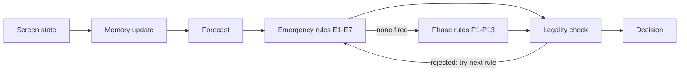

# Decision engine

Each turn the advisor updates its memory, runs the emergency rules, then the phase rules, and returns the first tool that passes the legality check. Nothing is scripted per malady, so a skill fail or a sudden heart stop is handled like any other state. The mechanics behind every rule are in [game-model.md](game-model.md).



```python
def decide(state: ScreenState, memory: Memory, config: Config) -> Decision:
    memory.update(state)
    forecast = Forecast.from_state(state, memory, config)
    for rule in RULES:                      # E1..E7, then P1..P13, in priority order
        decision = rule(state, memory, forecast, config)
        if decision and is_legal(decision.tool, state, memory):
            return decision
    return fallback(state)                  # Antiseptic if usable, else Sponge
```

## Strategy: stay awake as long as possible

The heart can only stop while the patient is asleep, at 10% per tool. So every tool that works on an awake patient (Ultrasound, Lab Kit, Antibiotics, Splint, Stitches on surface bleeding, Transfusion, Antiseptic) is used **before** the Anesthetic. Once the first incision is open, the patient stays asleep until the last incision is closed, because an awake patient with an open incision bleeds more every turn.

Maladies that need no incisions (the three flus, Broken Arm) never get Anesthetic at all.

| Phase | Patient | Work done |
| --- | --- | --- |
| Prep | Awake | Diagnose, kill the fever, splint broken bones, stitch surface bleeding, clean the site |
| Operate | Asleep | Anesthetic, cut to the needed count, Fix It, Pins on shattered bones, Clamp heavy bleeding |
| Close | Asleep | Stitches until incisions are 0 |
| Finish | Either | Splint pinned bones, stitch any remaining bleeding, wait out the temperature |

Phases are not stored; each rule's guard works out from the state and memory whether its phase applies.

## Rules

First draft, in priority order. The benchmark will reorder and tune them. IDs are permanent (see [AGENTS.md](../AGENTS.md#hard-rules)).

### Emergency rules

| ID | Name | Fires when | Tool |
| --- | --- | --- | --- |
| E1 | Revive | Status is `heart_stopped` | Defibrillator |
| E2 | Clear view | Visibility is `cant_see`, or `hard_to_see` while bleeding + open incisions is at or above the dirt guard | Sponge |
| E3 | Save pulse | Worst-case forecast pulse for next turn is `extremely_weak` (see [Forecast](#forecast)) | Transfusion |
| E4 | Keep asleep | An incision is open and status is `awake` or `coming_to` | Anesthetic |
| E5 | Stop heavy bleeding | Bleeding is `losing` or `very_quickly` and an incision is open | Clamp |
| E6 | Fever crisis | Fever is `climbing_fast`, or forecast temperature reaches the crisis threshold within 2 turns | Lab Kit if not done, else Antibiotics |
| E7 | Clean open site | Site is not `clean`, an incision is open, and the fever is not yet known to be negative | Antiseptic |

When the heart stops and the site is `cant_see`, E1's Defibrillator isn't usable, so E2's Sponge fires first. That leaves exactly one Defibrillator try; at low skill the dirt guard keeps this from happening.

### Phase rules

| ID | Name | Fires when | Tool |
| --- | --- | --- | --- |
| P1 | Diagnose | No diagnosis yet | Ultrasound |
| P2 | Break fever | Fever is positive (fever text shown, or temperature rose since last turn) and not yet known to be negative | Lab Kit if not done, else Antibiotics |
| P3 | Fix | Fix It is usable | Fix It |
| P4 | Pin | Shattered bones and an incision open | Pins |
| P5 | Cut | A cut is needed (incisions below the needed count, or shattered bones with no incision open) and status is `unconscious` or `coming_to` | Scalpel |
| P6 | Close | Incision open, malady fixed (or no Fix It needed), no shattered bones | Stitches |
| P7 | Splint | Diagnosed, broken bones, no incision open | Splint |
| P8 | Surface bleeding | Bleeding, no incision open | Stitches |
| P9 | Clean before cutting | A cut is needed next, site not `clean`, fever not yet known to be negative | Antiseptic |
| P10 | Prep for cutting | A cut is needed next and status is `awake` | Anesthetic |
| P11 | Finish fever | Temperature at or above the success threshold and fever not yet known to be negative | Lab Kit if not done, else Antibiotics |
| P12 | Tidy | Visibility is `hard_to_see` | Sponge |
| P13 | Wait | Nothing else fired (for example, waiting for a falling temperature) | Antiseptic |

"A cut is needed" requires a diagnosis. Without one, the advisor never anesthetizes or cuts.

## Legality check

A decision is rejected, and the next rule is tried, when any of these is true:

| Check | Why |
| --- | --- |
| Tool not in `usable_tools` | The tray has it greyed out |
| Scalpel while `awake` | Kills the patient |
| Anesthetic while `unconscious` | Kills the patient |
| Scalpel when incisions already meet the known needed count | Stabs a vital organ: bleeding +1 |
| Clamp with no bleeding shown | Pushes bleeding below 0; the surgery can never succeed |
| Splint before diagnosis or with no broken bones | Pushes broken bones below 0 |
| Pins before diagnosis or with no shattered bones | Pushes shattered bones below 0 |
| Antibiotics at 98.6°F | No effect; wastes a turn |

The property test in `tests/advisor/` generates random screen states and asserts that no decision ever breaks this table.

## Memory

The advisor remembers what the screen stops showing. Memory changes only when `last_tool_text` confirms a success; a text containing `[Skill Fail` means the tool did nothing.

| Field | Set from | Used by |
| --- | --- | --- |
| `diagnosis` | Scan text after Ultrasound (or at start for Nose Job) | P1, every "cut needed" guard |
| `incisions_needed` | Malady table, +1 for Tough Skin | P5, legality check |
| `needs_fix`, `fixed` | Malady table; "You fixed the issue!" | P3, P6 |
| `condition` | Condition text at start, or revealed by Ultrasound | Margins, E3, E6 |
| `sleep_left` | Set to 9 (4 if Hyperactive) on "The patient is now asleep."; minus 1 per turn while the heart beats | Forecast, E4 |
| `lab_kit_done` | "…have antibiotics at the ready." | E6, P2, P11 |
| `fever_negative` | After a successful Antibiotics dose, the fever text is gone and temperature fell | E6, E7, P2, P9, P11 |
| `prev_temperature`, `prev_state` | Last turn's state | P2, `fever_negative` |
| `turn` | Count of decisions made | Logs |

Confirmation texts live in one table in `src/advisor/memory.py`, copied from SurgE's `core/patient.py`.

## Forecast

The forecast predicts next turn's worst case from the screen words, using the upper bound of each hidden range from [game-model.md](game-model.md#what-the-screen-shows).

| Value | Worst-case estimate for next turn |
| --- | --- |
| Pulse | Lowest pulse in the current word's range − (highest bleeding in its range; `very_quickly` counts as the configured cap, default 6) − (1 if an incision is open) |
| Temperature | Current temperature + highest fever rate in the fever word's range, per turn |
| Sleep | `sleep_left` − 1 |
| Dirt | Whether bleeding + open incisions could take visibility to `cant_see` |

The forecast is deliberately pessimistic. The benchmark decides whether it is too pessimistic.

## Special conditions

| Condition | How the advisor adapts |
| --- | --- |
| Tough Skin | Plans one extra incision |
| Hyperactive | Expects 2 Unconscious turns, not 7; E4 re-doses at the first Coming to |
| Filthy | Expects the site to go dirty every turn; E7 and P9 fire more often |
| Antibiotic-resistant | Expects each Antibiotics dose to do half as much, so P2 and E6 dose until the fever is known to be negative |
| Hemophiliac | Treats every bleed as double: E3 and E5 fire one step earlier |
| Hidden (before Ultrasound) | Assumes neither hidden condition |
| Nose Job (Ultrasound never usable) | Assumes **both** hidden conditions. Nose Job starts with no fever or bleeding, so the extra caution costs little |

## Safety margins by fail rate

Margins depend on the fail rate, not the skill level, because modifiers change the rate. They live in `src/advisor/config.py`.

| Margin | Fail rate under 10% | 10–19% | 20% and above |
| --- | --- | --- | --- |
| Dirt guard (bleeding + open incisions, at `hard_to_see`) | 4 | 3 | 2 |
| Fever crisis temperature (°F) | 108 | 107 | 106 |
| Pulse forecast turns ahead | 1 | 1 | 2 |

These are starting values for the M3 benchmark to tune.

## Threshold profiles

| Setting | `surge` (default) | `wiki` |
| --- | --- | --- |
| `success_temp_f` | 101.0 | 100.4 |
| `hyperactive_sleep` | 5 | 4 |
| `dirt_raises_fails` | false | true |

See [game-model.md](game-model.md#where-surge-and-the-real-game-differ). The default stays `surge` until PRD open question Q1 is decided.
