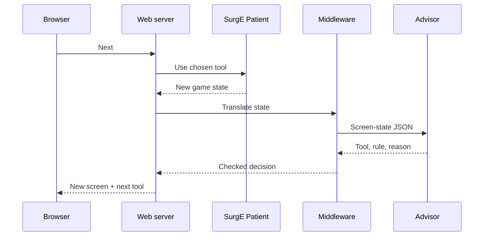

# Testing

Testing has three layers: unit tests for the advisor and harness, a seeded benchmark that measures success rates over 162,000 SurgE surgeries, and a step-by-step web viewer for watching one surgery at a time. All three run against SurgE's unmodified `Patient` class through `src/harness/`.

## Unit tests

| Suite | Covers | Needs SurgE |
| --- | --- | --- |
| `tests/advisor/test_rules.py` | One hand-built state per rule where it should fire, and one where it shouldn't | No |
| `tests/advisor/test_legality.py` | Property test: random screen states never produce a decision that breaks the [legality check](decision-engine.md#legality-check) | No |
| `tests/advisor/test_memory.py` | Memory changes only on confirmed success; skill fails leave it unchanged | No |
| `tests/advisor/test_forecast.py` | Worst-case pulse, temperature and sleep estimates | No |
| `tests/harness/test_observe.py` | Each screen-state enum value produced from a real SurgE patient | Yes |
| `tests/harness/test_runner.py` | Same seed gives the same surgery; two interleaved surgeries don't change each other's rolls | Yes |

Run with `uv run pytest`. The advisor suites must pass without `vendor/SurgE` present: they load malady and condition data from a small copy in `tests/advisor/fixtures/`, which also proves the advisor doesn't depend on SurgE's code.

## Harness

### Starting a surgery

The harness starts every surgery the way SurgE's Discord cog does (`cogs/surgery_cog.py`):

1. `TextManager.setTextManager(False)` (plain-text mode), once per process
2. `Patient(SkillLevel=…, malady=…, specialcondition=…, modifier=…, TrainEMode=False)`, always with an explicit special condition
3. Set `PatientStatus` to the Awake text, and the scan text to "The patient has not been diagnosed." if it is empty
4. `UpdatePatientUITexts()`

Skipping step 3 leaves the status empty, and a Scalpel on turn 0 would not kill the patient as it should. Other SurgE quirks the harness handles are listed in [AGENTS.md](../AGENTS.md#surge-gotchas).

### Each turn

1. `observe.py` builds the screen state from SurgE's display texts and the tool-tray conditions.
2. The policy (advisor or baseline) returns a decision.
3. The runner rejects the decision if its tool isn't usable, records an illegal move, and applies the Sponge instead (always usable) so the surgery can go on.
4. The runner calls `UseTool()` with the surgery's own random state swapped in, then swaps it back out.
5. The turn is logged as one JSON line.
6. The surgery stops on SurgE's end text or at the 80-turn cap.

### Outcomes

| Outcome | Meaning |
| --- | --- |
| `success` | SurgE's "The surgery was a success!" |
| `avoidable_death` | Death in a surgery where the policy chose an illegal move at any turn, or where a different usable tool would have prevented the fatal turn |
| `unlucky_death` | Death no legal tool could prevent, such as two Defibrillator fails in a row |
| `timeout` | 80 turns without an ending |

Telling avoidable from unlucky deaths: for each death, the runner replays the surgery up to the fatal turn from its seed, then tries every other usable tool from that same state and random draw. If any alternative survives that turn, the death is avoidable. This check runs on deaths only, so it stays cheap.

**Lookback.** A mistake made earlier, such as never clamping a bleed, would still count as unlucky with that one-turn check. `--lookback N` (`surg bench`, `surg play`; default 1, at least 1) looks back up to N turns, newest first. At the fatal turn (0 turns back) the check above is used as it is, so `--lookback 1` gives exactly the classification described above. At each earlier turn *t* (1 to N-1 turns back) the runner branches: for every usable tool other than the one applied at *t* (in `usable_tools` order), it applies that tool and lets a fresh copy of the same policy play on to the end, with the usual turn cap. A branch works if it ends in success in at least 2 of 3 rollouts. Rollout *r* uses `random.Random(f"{seed}-{t}-{tool}-{r}")` from the branch point on, so the result is repeatable but not one lucky draw; a branch stops as soon as 2 rollouts have won or 2 have failed.

The death is avoidable at the newest turn where some branch works. If nothing works within N turns it is unlucky. An illegal move still makes it avoidable. To branch at *t*, the runner builds a fresh policy, replays the tools applied before *t* with the surgery's seeded random state, and feeds the policy every screen on the way, so the advisor's memory matches. At *t* the policy has made its own pick; if it has a `note_override(tool)` method (the advisor does), the runner calls it so memory confirms the tool that was really applied next turn. The stateless baselines need no such hook.

`Result` (and each death entry in a report cell) carries two more fields: `mistake_turns_back`, how many turns before the fatal one the working branch was (0 is the fatal turn itself), and `alternative`, the first tool in `usable_tools` order that worked. Both are null for an unlucky death, for a death caused by an illegal move, and for surgeries that did not die. The report meta records `lookback`, and `--compare` refuses a saved report with a different one (a report with no `lookback` key counts as 1). Deeper lookback only moves deaths from unlucky to avoidable, never the other way, and never changes success rates. It costs time in proportion to the deaths: see the AGENTS.md command `surg bench --runs 50 --lookback 3`.

**Limits:** an alternative is judged by playing the same policy on, so "avoidable" means "the policy's own later play would have won", not "some perfect play would have". Only one tool is swapped, at one turn; two mistakes that each needed fixing count as unlucky.

## Train-E baseline

The baseline is the number to beat. Each turn it takes SurgE's first Train-E tip whose tool is usable.

- Tips are generated with `TrainE` switched on only around a call to `_UpdateTrainEText()`. The surgery itself always runs with Train-E mode off, because Train-E mode changes the rules (Anesthetic on an unconscious patient gives Near Coma instead of death).
- Each tip heading maps to one tool, in the order SurgE writes them:

| Tip heading | Tool |
| --- | --- |
| Heart Stopped | Defibrillator |
| Awake (with an open wound) | Anesthetic |
| Stitch it Up! | Stitches |
| Fix It! | Fix It |
| Clean the Area | Antiseptic |
| Prep Patient | Anesthetic |
| Make an Incision! | Scalpel |
| Poor Visibility | Sponge |
| Diagnosis | Ultrasound |
| Losing Blood | Clamp if an incision is open, else Stitches |
| Shattered Bone | Pins |
| Broken Bone | Splint |
| Fever / High Fever / Antibiotics | Lab Kit if not done, else Antibiotics |
| Extremely Weak Pulse | Transfusion |
| Coming To | Anesthetic |

If no tip maps to a usable tool, the baseline uses the Sponge.

SurgE writes the "Losing Blood" tip with no newline when bleeding is under 4, so the next tip is glued onto it ("Losing BloodShattered Bone - …"). The parser splits them apart, otherwise the following tip is lost.

### Second reference policy: `train-e-plus`

Train-E has three blind spots that make the pure baseline stall until the turn cap or fail outright. It asks for Pins but never says to cut first. Its "Stitch it Up!" tip outranks "Shattered Bone", so it closes the incision before Pins can be used. And it treats a fever only when one is shown, so patients that start hot with no fever (Grumbleteeth, Liver Infection) are never cooled. `--policy train-e-plus` plays exactly like `baseline` on every turn where Train-E has a usable tip, with one exception, and patches the rest where `baseline` would give up and use the Sponge. Rules: `TP1` Lab Kit then Antibiotics for a temperature at or above 101°F with no fever shown; `TP2` Anesthetic or Scalpel to open the incision Pins need; `TP3` (the exception) Pins before Stitches while a shattered bone and an open incision both exist. It shows how much of the advisor's gain over Train-E comes from fixing those holes. **The target in PRD section 10 stays the pure `baseline`.**

## Benchmark

```bash
uv run surg bench --runs 200                                  # full grid
uv run surg bench --runs 5                                    # quick check
uv run surg bench --runs 20 --compare reports/baseline.json   # before/after a change
uv run surg bench --policy baseline --runs 200                # score the baseline
uv run surg bench --runs 200 --out reports/baseline           # write reports/baseline.json and .md
uv run surg bench --skills 100 --modifiers exquisite_bone_saw --runs 200   # the owner's setup
```

`--policy` is `advisor` (the default, minimal Antiseptic), `advisor-draft-antiseptic`, `baseline` or `train-e-plus`. `--skills` takes a comma list of levels (default `0,25,50,75,100`) and `--modifiers` a comma list of modifier ids or `none` (default `none`); each builds the grid's skill and modifier axes. The owner's setup is 27 maladies × 6 conditions × skill 100 × the Exquisite Bone Saw: 162 cells.

### Grid

| Dimension | Values | Count |
| --- | --- | --- |
| Malady | Every entry in `vendor/SurgE/data/maladies.json` | 27 |
| Special condition | `none`, `tough_skin`, `antibiotic_resistant`, `filthy`, `hyperactive`, `hemophiliac` | 6 |
| Skill level | 0, 25, 50, 75, 100 | 5 |
| Modifier | None | 1 |
| Runs per cell | Seeds 0 to N−1 | 200 |

That is 810 cells and 162,000 surgeries. Cells run in parallel across CPU cores.

A separate modifier run covers 27 maladies × 4 modifiers × skill 0 and 100 × 50 runs (10,800 surgeries), until PRD open question Q2 is decided.

### Seeds

Run *i* of a cell uses a seed derived from the cell and *i*, so the same grid always replays the same surgeries. Never compare runs with different `--runs` values or grid settings.

### Report

Written to `reports/<timestamp>.json` and `reports/<timestamp>.md`, or to `<BASE>.json` and `<BASE>.md` with `--out BASE`. `--compare` refuses a saved report made with a different `--runs`, grid (including `--skills` and `--modifiers`), turn cap or `--lookback`. Every surgery gets a fresh policy, so the advisor's memory never carries over from one seed to the next.

The JSON holds the grid, per-cell outcome counts and, for every death, its seed, outcome, the last 3 rules that fired, and its `mistake_turns_back` and `alternative` (see Lookback above). Contents:

- Success rate and outcome counts per malady, per condition and per skill level, advisor and baseline side by side
- Tools used, since fewer is better once a surgery succeeds: the average per success and the fewest any success needed, in every row; a **Tools used** table of how many of each tool a success takes and how many every surgery spent in total (the gap is waste, such as Sponge loops); with `--compare`, the change in the average. The per-cell JSON keeps the counts per tool (`tool_counts_success`, `tool_counts_all`) and the fewest (`min_tools_on_success`). Each turn log line (`surg play --log`, the web turn log) records the tool applied, and the web end card lists the tools a surgery used.
- Caution: the averages of two policies are not like for like when one succeeds on harder surgeries, because those need more tools. Judge efficiency on surgeries both policies win (see [Paired tool comparison](#paired-tool-comparison)).
- For every death, the rules that fired in the last 3 turns, then rules ranked by how often they appear before deaths
- A viewer link for each death, in the `surg report` output: `http://127.0.0.1:8000/?malady=…&condition=…&skill=…&seed=…&policy=…`, plus `&modifier=…` when set (see [Reports](#reports))
- With `--compare`, the change in each number against the saved report

Each cell also holds `seed_tools`: one entry per seed in seed order, the per-tool counts of that surgery as a list in `meta.tool_order` order when it succeeded, `null` otherwise. The paired comparison below needs it, so reports saved before it existed still work with `--compare` but not with `surg tools`; re-run `surg bench` to get it.

### Paired tool comparison

Averages over each policy's own successes are unfair when one policy wins harder surgeries. `surg tools` lines the two policies up instead: a **pair** is one seed of one cell that both reports won, and only pairs are compared.

```bash
uv run surg bench --runs 200 --out reports/advisor
uv run surg bench --policy baseline --runs 200 --out reports/baseline
uv run surg tools reports/advisor.json reports/baseline.json   # writes reports/tools-advisor-vs-baseline.json and .md
```

Both reports must come from the same `--runs`, grid and turn cap, or `surg tools` refuses with the same message as `--compare`. The `--lookback` may differ. `--out BASE` writes `BASE.json` and `BASE.md` elsewhere. The first report is *A* and the second *B*. Fewer tools is better, so a positive Difference (A minus B per success) means A uses more.

The Markdown has, overall and by skill level, special condition and malady: pairs, the share of surgeries both won, each policy's wins, tools per success on the pairs, the difference, and the fewest tools any success needed. **Where the difference comes from** lists each tool's per-success count for A and B over all pairs, largest gap first, and **Biggest differences by malady** gives each malady's difference with the three tools that explain it most.

"Fewest" is the lowest total tool count over every success of either policy in the group, not only the pairs. It is the reference to approach when tuning. The per-cell version is in the JSON `cells` list (`fewest`, `a_fewest`, `b_fewest` next to `pairs` and each policy's tools per success).

### Reports

`surg report A.json B.json` puts two benchmark reports side by side and analyses the deaths of A. A is the policy being studied (the advisor), B the reference (the baseline).

```bash
# Owner's setup (skill 100, Exquisite Bone Saw) and the full grid
uv run surg report reports/main-advisor-lb3.json reports/main-baseline.json --out reports/m3-main
uv run surg report reports/advisor-lb3.json reports/baseline.json --out reports/m3-full
# Modifier run: 27 maladies x 6 conditions x 4 modifiers x skill 0 and 100 x 50 runs
uv run surg bench --runs 50 --skills 0,100 --modifiers stethoscope,tea,exquisite_bone_saw,nano_nurse_bot --lookback 3 --out reports/mod-advisor
uv run surg bench --runs 50 --skills 0,100 --modifiers stethoscope,tea,exquisite_bone_saw,nano_nurse_bot --policy baseline --out reports/mod-baseline
uv run surg report reports/mod-advisor.json reports/mod-baseline.json --out reports/m3-mod
```

The default output is `reports/report-<A>-vs-<B>.json` and `.md`; `--out BASE` writes `BASE.json` and `BASE.md`, and `--examples N` (default 3) sets how many avoidable deaths per malady get a line in the examples section. The reports must have the same `--runs`, grid and turn cap. They may have different `--lookback`: success does not depend on it. Avoidable counts do, so run A with `--lookback 3` and expect B's avoidable column (usually lookback 1) to be an undercount; judge the policies by success and by A's own death analysis.

The Markdown has:

- **Side by side** for overall, skill level, special condition and malady (and modifier when the grid has more than one): both success rates, the difference in points, A's avoidable, unlucky and timeout deaths, B's avoidable deaths, and tools per success on the surgeries both won (as in `surg tools`; blank when a report has no `seed_tools`).
- **Deaths: rules in the last 3 turns**: every death of A, ranked by the number of deaths with the rule among the rules that fired in their last 3 turns, split into avoidable and unlucky, with the share of all deaths and the total appearances.
- **Rule at the mistake turn**: for each avoidable death with a mistake turn *k* turns back, the rule that fired then (`last_rules[-1-k]`; a mistake further back than the 3 kept rules is counted separately), the tool that would have won most often, and the mean *k*.
- **Mistake depth** (deaths by *k*, with illegal moves apart), **Better tools** (the `alternative` over avoidable deaths) and **By malady** (deaths, avoidable, top mistake rule and top better tool).
- **Examples with viewer links**: per malady, up to N avoidable deaths with their settings, seed, *k*, better tool, last rules and a link to the viewer. Start `uv run surg web` first.

The JSON holds the same tables plus every death of A (`analysis.deaths`) and every avoidable one (`analysis.avoidable_deaths`), each with its viewer link and `mistake_rule`.

## Web viewer

A local page plays one SurgE surgery in slow motion. It shows the patient screen and the tool the advisor picked; each press of Next applies that tool and advances one turn, until SurgE ends the surgery in success or failure. Nobody types states by hand: the middleware reads them from SurgE.



One press of Next is one round trip: apply the tool, let SurgE run its turn update, then ask the advisor for the following tool.

### Parts

| Part | Module | What it does |
| --- | --- | --- |
| Simulation | `vendor/SurgE` via `harness/surge.py` | SurgE's `Patient` class, one per open surgery |
| Middleware | `harness/observe.py`, `harness/runner.py` | Builds the screen-state JSON from display text, computes usable tools, rejects unusable decisions |
| Advisor | `advisor/engine.py` | The same `decide()` the CLI and benchmark use |
| Web server | `web/app.py` | FastAPI on `127.0.0.1:8000`, started with `uv run surg web` |
| Page | `web/static/index.html` | One HTML file, no build step |

### Endpoints

| Endpoint | What it does |
| --- | --- |
| `POST /surgeries` | Starts a surgery from malady, special condition, skill level (0–100), modifier, policy and seed; blank fields are random (a blank modifier means none; the same seed fills blanks the same way) |
| `GET /` and `GET /options` | The page, and the malady, condition, modifier, policy and tool lists the form uses |
| `GET /surgeries/{id}` | Returns the current screen, the pending decision and the turn log |
| `POST /surgeries/{id}/next` | Applies the pending decision, runs one turn, returns the new screen and next decision |
| `POST /surgeries/{id}/restart` | Replays from turn 0 with the same settings and seed |

Surgeries live in server memory only; restarting the server clears them, and only the newest 100 are kept. `uv run surg web --port N` changes the port; there is deliberately no way to change the host.

### Page

- **Patient screen**, laid out like the game: pulse, status, temperature, operation site, incisions, bones, bleeding and fever text, the last tool's message, and the tool tray with unusable tools greyed out.
- **Advisor panel:** the next tool (also highlighted in the tray), its rule ID and reason.
- **Controls:** Next, Auto-play with a speed slider (0.5–3 seconds per turn), Pause, Restart, and a New surgery form.
- **Turn log:** turn number, tool, whether it skill-failed, the rule, and what changed (for example, pulse `steady` to `weak`).
- **End card:** SurgE's result message, turns taken, tools used and skill fails.
- **Train-E toggle:** shows SurgE's own hint next to the advisor's pick.
- **URL parameters:** `malady`, `condition`, `skill`, `modifier`, `seed` and `policy` start a surgery directly, so benchmark links open the exact run. An unknown `policy` falls back to the first one in the list.

### Flow

1. Choose the settings and start. The page shows turn 0 and the advisor's first tool.
2. Press Next. The server applies the tool, SurgE runs its turn update, and a skill fail or heart stop may happen.
3. The page shows the new screen and the next tool. Repeat until SurgE ends the surgery.

### Notes

- The viewer uses the same 80-turn cap as the benchmark, in place of the real 2-minute timer.
- It binds to `127.0.0.1` only. Hosting it publicly would mean publishing source under SurgE's AGPL-3.0.
