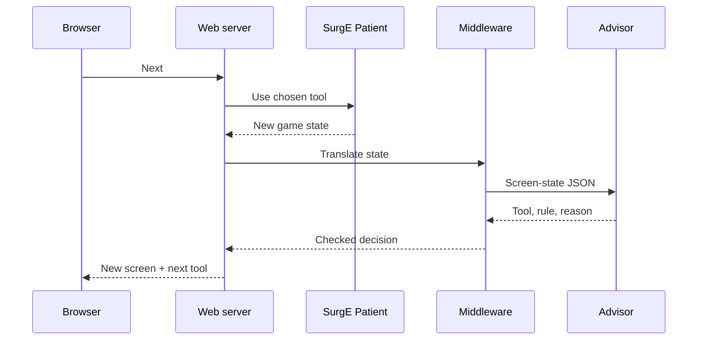

# Testing

Testing has three layers: unit tests for the advisor and harness, a seeded benchmark that measures success rates over 162,000 SurgE surgeries, and a step-by-step web viewer for watching one surgery at a time. All three run against SurgE's unmodified `Patient` class through `src/harness/`.

## Unit tests

| Suite | Covers | Needs SurgE |
| --- | --- | --- |
| `tests/advisor/test_rules.py` | One hand-built state per rule where it should fire, and one where it shouldn't | No |
| `tests/advisor/test_legality.py` | Property test: random screen states never produce a decision that breaks the [legality check](decision-engine.md#legality-check) | No |
| `tests/advisor/test_memory.py` | Memory changes only on confirmed success; skill fails leave it unchanged | No |
| `tests/advisor/test_forecast.py` | Worst-case pulse, temperature and sleep estimates | No |
| `tests/harness/test_observe.py` | Each screen-state enum value produced from a real SurgE patient | Yes |
| `tests/harness/test_runner.py` | Same seed gives the same surgery; two interleaved surgeries don't change each other's rolls | Yes |

Run with `uv run pytest`. The advisor suites must pass without `vendor/SurgE` present: they load malady and condition data from a small copy in `tests/advisor/fixtures/`, which also proves the advisor doesn't depend on SurgE's code.

## Harness

### Starting a surgery

The harness starts every surgery the way SurgE's Discord cog does (`cogs/surgery_cog.py`):

1. `TextManager.setTextManager(False)` (plain-text mode), once per process
2. `Patient(SkillLevel=…, malady=…, specialcondition=…, modifier=…, TrainEMode=False)`, always with an explicit special condition
3. Set `PatientStatus` to the Awake text, and the scan text to "The patient has not been diagnosed." if it is empty
4. `UpdatePatientUITexts()`

Skipping step 3 leaves the status empty, and a Scalpel on turn 0 would not kill the patient as it should. Other SurgE quirks the harness handles are listed in [AGENTS.md](../AGENTS.md#surge-gotchas).

### Each turn

1. `observe.py` builds the screen state from SurgE's display texts and the tool-tray conditions.
2. The policy (advisor or baseline) returns a decision.
3. The runner rejects the decision if its tool isn't usable, records an illegal move, and applies the Sponge instead (always usable) so the surgery can go on.
4. The runner calls `UseTool()` with the surgery's own random state swapped in, then swaps it back out.
5. The turn is logged as one JSON line.
6. The surgery stops on SurgE's end text or at the 80-turn cap.

### Outcomes

| Outcome | Meaning |
| --- | --- |
| `success` | SurgE's "The surgery was a success!" |
| `avoidable_death` | Death in a surgery where the policy chose an illegal move at any turn, or where a different usable tool would have prevented the fatal turn |
| `unlucky_death` | Death no legal tool could prevent, such as two Defibrillator fails in a row |
| `timeout` | 80 turns without an ending |

Telling avoidable from unlucky deaths: for each death, the runner replays the surgery up to the fatal turn from its seed, then tries every other usable tool from that same state and random draw. If any alternative survives that turn, the death is avoidable. This check runs on deaths only, so it stays cheap.

**Limit:** the check is one turn deep. A death caused by a mistake made earlier, such as never clamping a bleed, is counted as unlucky. Milestone M3 adds a deeper lookback ([PLAN.md](../PLAN.md)).

## Train-E baseline

The baseline is the number to beat. Each turn it takes SurgE's first Train-E tip whose tool is usable.

- Tips are generated with `TrainE` switched on only around a call to `_UpdateTrainEText()`. The surgery itself always runs with Train-E mode off, because Train-E mode changes the rules (Anesthetic on an unconscious patient gives Near Coma instead of death).
- Each tip heading maps to one tool, in the order SurgE writes them:

| Tip heading | Tool |
| --- | --- |
| Heart Stopped | Defibrillator |
| Awake (with an open wound) | Anesthetic |
| Stitch it Up! | Stitches |
| Fix It! | Fix It |
| Clean the Area | Antiseptic |
| Prep Patient | Anesthetic |
| Make an Incision! | Scalpel |
| Poor Visibility | Sponge |
| Diagnosis | Ultrasound |
| Losing Blood | Clamp if an incision is open, else Stitches |
| Shattered Bone | Pins |
| Broken Bone | Splint |
| Fever / High Fever / Antibiotics | Lab Kit if not done, else Antibiotics |
| Extremely Weak Pulse | Transfusion |
| Coming To | Anesthetic |

If no tip maps to a usable tool, the baseline uses the Sponge.

## Benchmark

```bash
uv run surg bench --runs 200                                  # full grid
uv run surg bench --runs 5                                    # quick check
uv run surg bench --runs 20 --compare reports/baseline.json   # before/after a change
uv run surg bench --policy baseline --runs 200                # score the baseline
uv run surg bench --runs 200 --out reports/baseline           # write reports/baseline.json and .md
```

### Grid

| Dimension | Values | Count |
| --- | --- | --- |
| Malady | Every entry in `vendor/SurgE/data/maladies.json` | 27 |
| Special condition | `none`, `tough_skin`, `antibiotic_resistant`, `filthy`, `hyperactive`, `hemophiliac` | 6 |
| Skill level | 0, 25, 50, 75, 100 | 5 |
| Modifier | None | 1 |
| Runs per cell | Seeds 0 to N−1 | 200 |

That is 810 cells and 162,000 surgeries. Cells run in parallel across CPU cores.

A separate modifier run covers 27 maladies × 4 modifiers × skill 0 and 100 × 50 runs (10,800 surgeries), until PRD open question Q2 is decided.

### Seeds

Run *i* of a cell uses a seed derived from the cell and *i*, so the same grid always replays the same surgeries. Never compare runs with different `--runs` values or grid settings.

### Report

Written to `reports/<timestamp>.json` and `reports/<timestamp>.md`, or to `<BASE>.json` and `<BASE>.md` with `--out BASE`. Until the advisor exists (M2), `--policy` defaults to `baseline`, and `--policy advisor` exits with an error. `--compare` refuses a saved report made with a different `--runs`, grid or turn cap.

The JSON holds the grid, per-cell outcome counts and, for every death, its seed, outcome and the last 3 rules that fired. Contents:

- Success rate and outcome counts per malady, per condition and per skill level, advisor and baseline side by side
- Average tools used per success
- For every death, the rules that fired in the last 3 turns, then rules ranked by how often they appear before deaths
- A viewer link for each death: `http://127.0.0.1:8000/?malady=…&condition=…&skill=…&seed=…`
- With `--compare`, the change in each number against the saved report

## Web viewer

A local page plays one SurgE surgery in slow motion. It shows the patient screen and the tool the advisor picked; each press of Next applies that tool and advances one turn, until SurgE ends the surgery in success or failure. Nobody types states by hand: the middleware reads them from SurgE.



One press of Next is one round trip: apply the tool, let SurgE run its turn update, then ask the advisor for the following tool.

### Parts

| Part | Module | What it does |
| --- | --- | --- |
| Simulation | `vendor/SurgE` via `harness/surge.py` | SurgE's `Patient` class, one per open surgery |
| Middleware | `harness/observe.py`, `harness/runner.py` | Builds the screen-state JSON from display text, computes usable tools, rejects unusable decisions |
| Advisor | `advisor/engine.py` | The same `decide()` the CLI and benchmark use |
| Web server | `web/app.py` | FastAPI on `127.0.0.1:8000`, started with `uv run surg web` |
| Page | `web/static/index.html` | One HTML file, no build step |

### Endpoints

| Endpoint | What it does |
| --- | --- |
| `POST /surgeries` | Starts a surgery from malady, special condition, skill level (0–100), modifier, policy and seed; blank fields are random (a blank modifier means none; the same seed fills blanks the same way) |
| `GET /` and `GET /options` | The page, and the malady, condition, modifier, policy and tool lists the form uses |
| `GET /surgeries/{id}` | Returns the current screen, the pending decision and the turn log |
| `POST /surgeries/{id}/next` | Applies the pending decision, runs one turn, returns the new screen and next decision |
| `POST /surgeries/{id}/restart` | Replays from turn 0 with the same settings and seed |

Surgeries live in server memory only; restarting the server clears them, and only the newest 100 are kept. `uv run surg web --port N` changes the port; there is deliberately no way to change the host.

### Page

- **Patient screen**, laid out like the game: pulse, status, temperature, operation site, incisions, bones, bleeding and fever text, the last tool's message, and the tool tray with unusable tools greyed out.
- **Advisor panel:** the next tool (also highlighted in the tray), its rule ID and reason.
- **Controls:** Next, Auto-play with a speed slider (0.5–3 seconds per turn), Pause, Restart, and a New surgery form.
- **Turn log:** turn number, tool, whether it skill-failed, the rule, and what changed (for example, pulse `steady` to `weak`).
- **End card:** SurgE's result message, turns taken, tools used and skill fails.
- **Train-E toggle:** shows SurgE's own hint next to the advisor's pick.
- **URL parameters:** `malady`, `condition`, `skill`, `modifier` and `seed` start a surgery directly, so benchmark links open the exact run.

### Flow

1. Choose the settings and start. The page shows turn 0 and the advisor's first tool.
2. Press Next. The server applies the tool, SurgE runs its turn update, and a skill fail or heart stop may happen.
3. The page shows the new screen and the next tool. Repeat until SurgE ends the surgery.

### Notes

- The viewer uses the same 80-turn cap as the benchmark, in place of the real 2-minute timer.
- It binds to `127.0.0.1` only. Hosting it publicly would mean publishing source under SurgE's AGPL-3.0.
